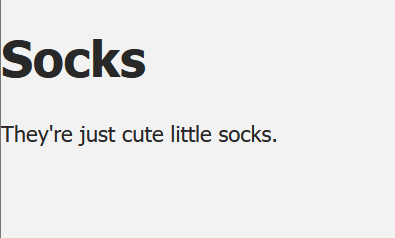

# Vue Video Tutorials
https://www.vuemastery.com/courses/intro-to-vue-3/intro-to-vue3

Will document new findings here as well as upload the whole project you make during these tutorials to this Repo.

# Part 1
## Starting out

The video asks you to clone this repo. https://github.com/Code-Pop/Intro-to-Vue-3

The linked script in the index.html is a Vue3 beta version. go to https://vuejs.org/guide/quick-start.html#using-vue-from-cdn and copy the global Vue script tag. 

```jsx

<script src="https://unpkg.com/vue@3.0.0-beta.12/dist/vue.global.js"></script>

//becomes

<script src="https://unpkg.com/vue@3/dist/vue.global.js"></script>

```

## Making the Vue app and mounting it.

First you create a regular JS file where you then make a Vue app. Were also instantly adding the Data function (using shorthand).

```jsx
//File called main.js containing this:

const app = Vue.createApp({
    //ES6 short hand for the data function
    data() {
    //instead of
    //data: function () {
        return {
            product: 'Socks'
        }
        
    }
})
```

Then this should be linked in the html and have a piece of code that then mounts the app we just created and linked.

```html
 <!-- Importing the Vue App instead of just JS-->
    <!-- Import App -->
    <script src="./main.js"></script>

    <!-- Mount app into the DOM -->
    <script>
      const mountedApp = app.mount('#app')
    </script>
```

## Using the just mounted app.

Now we can start referring to the data in our Vue App using Mustache

```html
<div id="app">
      <!-- Referring to our Product in our Data using mustache -->
      <h1>{{product}}</h1>
    </div>
```

Important to note that only HTML elements with an ID the name of the Vue app have access to the data


You can add more objects to data like this

```jsx
return {
            product: 'Socks',
            description: 'They\'re just cute little socks.'
        }
        
```

and display it on a page like this

```jsx
<div id="app">
      <!-- Referring to our Product in our Data using mustache -->
      <h1>{{product}}</h1>
      <p>{{description}}</p>
    </div>
```
looking something like this.


# Part 2

The tutorial asks to check out a github branch https://github.com/Code-Pop/Intro-to-Vue-3/tree/L3-start and
grab whatever you're missing, which in this case are some divs with some classes that have pre-written css.

```html
  <div id="app">
      <div class="nav-bar"></div>
      
      <div class="product-display">
        <div class="product-container">
          <div class="product-image">
            <!-- image goes here -->
          </div>
          <div class="product-info">
            <h1>{{ product }}</h1>
            <p>{{description}}</p>
          </div>
        </div>
      </div>
    </div>
```

## Attribute Binding
Time to add an image. To do this we add an image path to our Data object in our Vue App.

```jsx
image: './assets/images/socks_green.jpg'
```

and bind the image attribute as the source of an html img tag.

```html
 

 <!-- Or the shorthand for vbind. just a colon ':' -->


 ```
 and you can bind everything like this. 
 ```jsx
             url: 'https://github.com/Algoprazolam/She-learns-Vue.js',
            githubIcon: 'https://img.icons8.com/ios/50/github--v1.png',
            githubClass: 'github'

```
```html
<a :href="url"></a>
```